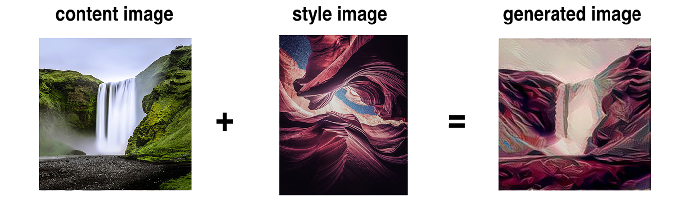
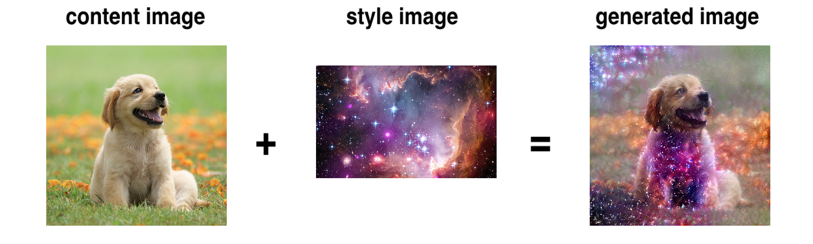
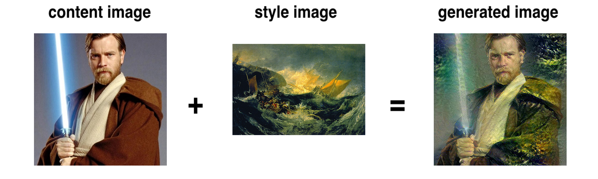

# Artistic Learning

Neural style transfer built on TensorFlow and Keras in Python with a deep convolutional neural network (CNN), learning shape of input content and style images. Recombines input images to produce an output resembling content image painted in style of style image.

## Description

The technique of neural style transfer is described in the original paper, [*A Neural Algorithm of Artistic Style*](https://arxiv.org/pdf/1508.06576.pdf) by Gatys, Ecker, and Bethge. The goal is to take a content image and a style image, then combine them so that the output image looks like the content image in the style of the style image. 

We define two loss functions, the content loss and the style loss. We attempt to transform the output image to minimize both loss functions. Both content and style images are fed into the VGG19 model, and values from the intermediate layers are used to compute the losses.

## Examples







## Getting Started

How to run the application

1. Clone the repository.
2. Open [hyperparameters.py](src/hyperparameters.py) and adjust the hyperparameters as desired. 
3. Run [main.py](src/main.py) with ```python main.py```. The output image is saved in [data/output](data/output).

## Built With

* [TensorFlow](https://www.tensorflow.org/) - Deep Learning

## License

This project is licensed under the MIT License - see [LICENSE](LICENSE) file for details.
